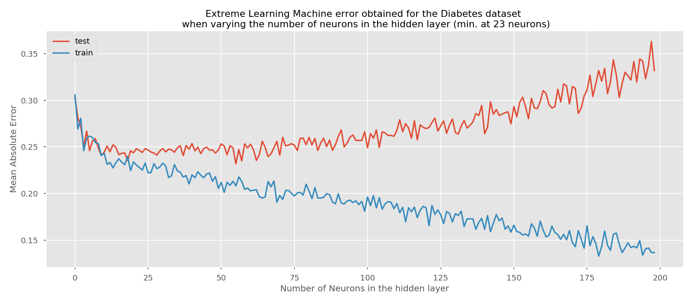
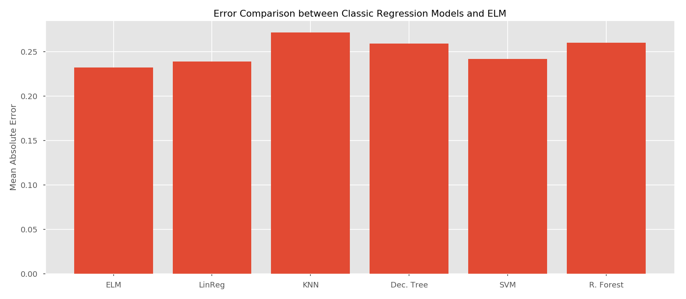

# The simplest implementation of the Extreme Learning Machine algorithm

The Extreme Learning Machine (ELM) is a Single Layer FeedForward Neural Network designed by Huang et Al [1]. It has some advantages over backpropagated neural networks:
- It gets rid of the iterative process
- It requires less computation that the backpropagation process
- It adjusts less parameters than the backpropagation algorithm, because the first layer parameters are selected randomly

The aim of this repository is to show how easy it is to program this algorithm and make it work with a real dataset.



## Installation
Just clone the repository and make sure you havbe `numpy` installed. 

## How to use it
Here is a very minimalistic sample.
```python
from ELM import ELMRegressor

elm = ELMRegressor(n_hidden_units=100)
elm.fit(train_x, train_y)

prediction = elm.predict(test_x)
```

You can see a more detailed example of how to use it on example.py

## Contribution
Please, feel free of contributing to the repository. If you think you can improve it or extend it in some way, just fork it, do it and send me a pull request!

## License
This repository is licensed using MIT License. Please review the `LICENSE.md` file 

## References

[1] G.-B. Huang, Q.-Y. Zhu and C.-K. Siew, "Extreme Learning Machine:
          Theory and Applications", Neurocomputing, vol. 70, pp. 489-501,
          2006.
